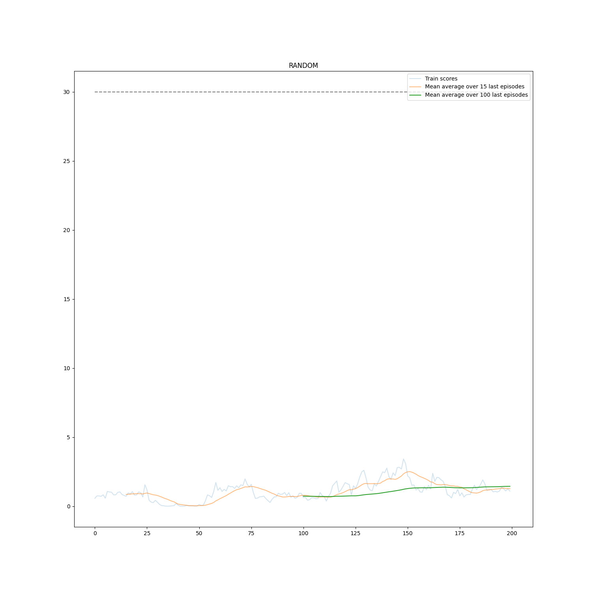
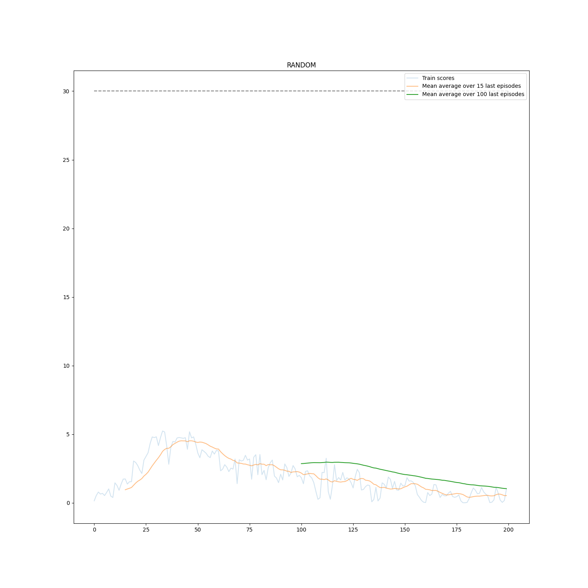
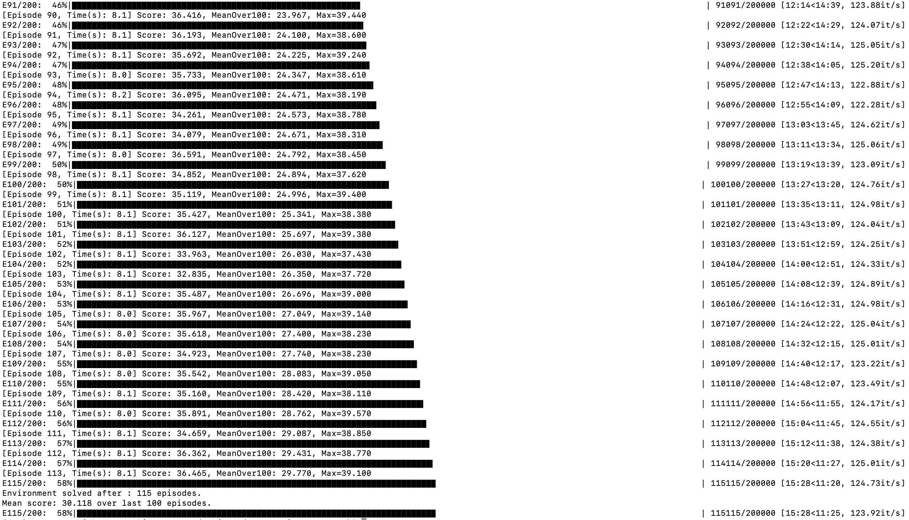

# Implementation details
Implementation assumed one agent to be trained on samples generated by all 20 arms using DDPG (Deep Deterministic Policy Gradient) algorithm. The algorithm learns proper action using actor critic approach. Critic learns Q-value (estimated future reward) while actor learns proper values depending on state the environment is in.

*Disclaimer*: some of the code was inspided by [Udacity's github Deep Reinforcement repository](https://github.com/udacity/deep-reinforcement-learning/tree/master/ddpg-pendulum) and my previous [DLR_Navigation](https://github.com/bwosh/DRL_Navigation) project.

Initial values were chosen:
* Both actor and critic use **32 & 32** neurons in hidden layers (critic has an addition of action size space in second layer).
* There are two copied of each networks (critic & actor) scause DDPG is an off-policy algorithm. Soft copy with **tau** value o **1e-3**was used
* Reward discount **gamma** was set to 0.99.
* Replay buffer to sample data for training was set to have size of **1e5**. Data was sampled using **batch_size** of **64**.
* The agent was trained after every step af all 20 arms.
* Target network was update after every training.

### Attempt 1
First implementation on network hidden layer counts equal to (32,32) with batch normalization after every fully connected network with learning rates set to 1e-3 was'nt giving good results:  


### Attempt 2
In second attempt I tried adding gradient normalization trick mentioned in Udacity's lecture:
```python
torch.nn.utils.clip_grad_norm(self.critic_local.parameters(), 1)
```

The result was slightly better byt still without success:  


### Attempt 3 (THE BEST)
First good results was achieved after setting learning rate of critic & actor both to 1e-4 with hidden layer neuron counts equal to (128,128). Batch normalization was removed from networks. The environment was solved in **115 episodes** (training weights can be found in [/data/](/data/) folder.)


### Attempt 4
I was curious if smaller network are able to solve environment as well.  
For hidden layers counts (64,64) it was solved in **171 episodes**.
64+64:  


# Future improvements
There may be further improvements to addres:
* Smaller number of epochs needed to train
* More stable values between epochs

That might involve:
* Adjust(lowering) learning rate to stabilize network results
* Lower tau value to gain stability while slowing down the training
* Adjusting the network architecture to improve speed of trainig
* Adjusting gamma value to care more/less for far future rewards
* Adding more penalty for no being in target location
* Balancing the replay memory in terms of positive and negative samples
* Finally: doing search of parameters using all points above

## Training screenshot
For interest of annybody dealing with siilar pdoject: training time of "Attempt3" version took 15.5 minutes on RTX 2080 Max-Q card + i7-9750H processor.  
